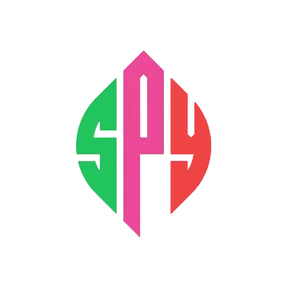

# SPY Project

- Demo URL: https://spyproject.netlify.app/

- SPY stands for (Spotify/Pinterest/Youtube). From this website, you can be updated with all real-time Top Charts/Artists/Pictures/Videos. All data are being fetched from working API.
- I find having two themes(light/dark) on every website getting old. So I created a theme that can toggle between 4 seasons(green, blue, red, grey) + 2 (light/dark) theme.
- Designed for Mobile as well!

**(Note: This website does not have the paid API key. Some components are limited)**

## Main Stack - M.E.R.N

### Frontend

- React as framework
- React Router for navigation
- Formik + yup for form validation
- Redux Toolkit for statemanagement
- Redux with Persistent for local storage
- React Bootstrap for video
- Tailwind/MUI for Design and CSS

### Backend (Coming up)

- NodeJS for run time
- ExpressJS for backend framework
- MongoDB for database
- JSON Web Token for authentication
- Multer for file upload

## How to Generate Working Website on your localhost

- Create `.env.local` file inside client
- Fill in the followings
- VITE_RAPID_API_KEY = https://rapidapi.com/tipsters/api/shazam-core/ <-- Go to this link and Sign Up, then you should see X-RapidAPI-Key inside Code Snippets. Copy it without the ""
- VITE_UNSPLASH_ACCESS_KEY = https://unsplash.com/@developer/ <-- Go to this link Sign Up, then create a project and they will give you API Key. Copy it without the ""

ex)

- VITE_RAPID_API_KEY = KJwZZIJSFimshuivMSVGaiYzkRomp15f2vKjsnK4bKzuUzVLzA

### Installation

You can install the latest version using npm:
cd to client folder then

`npm install`
`npm run dev`

